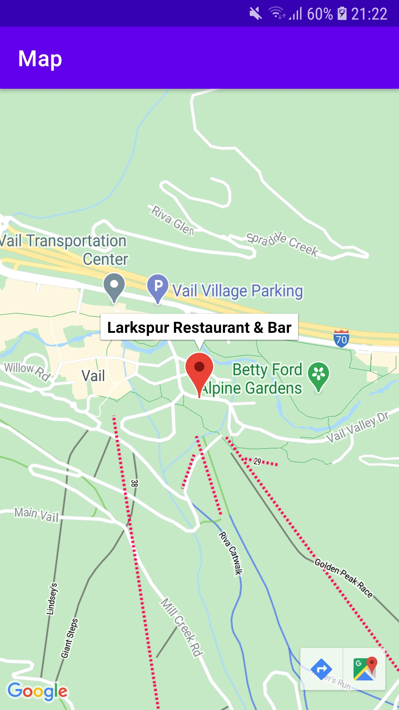
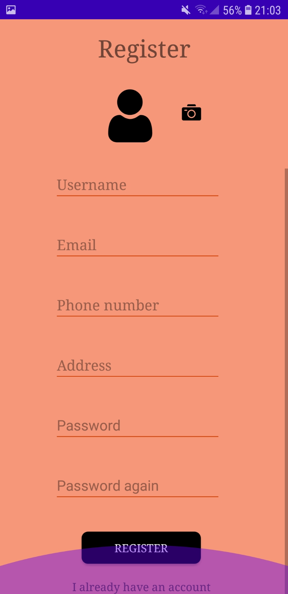
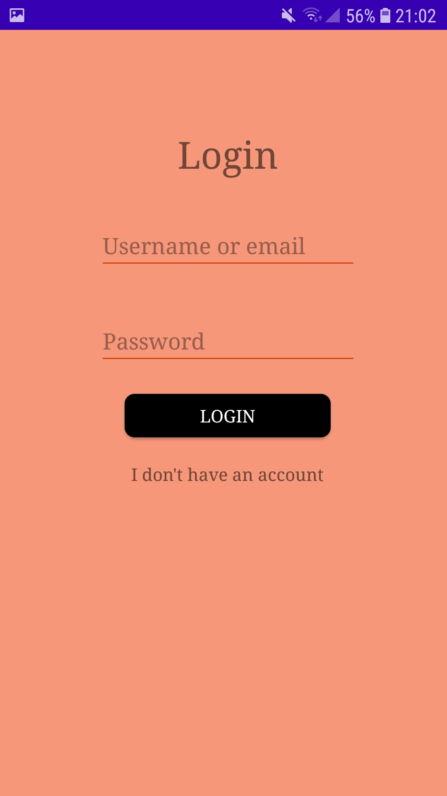
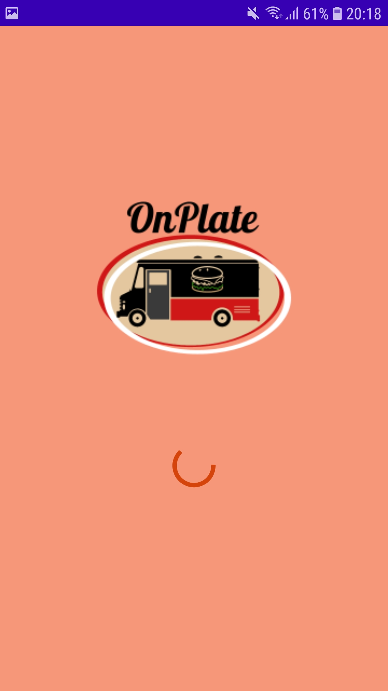
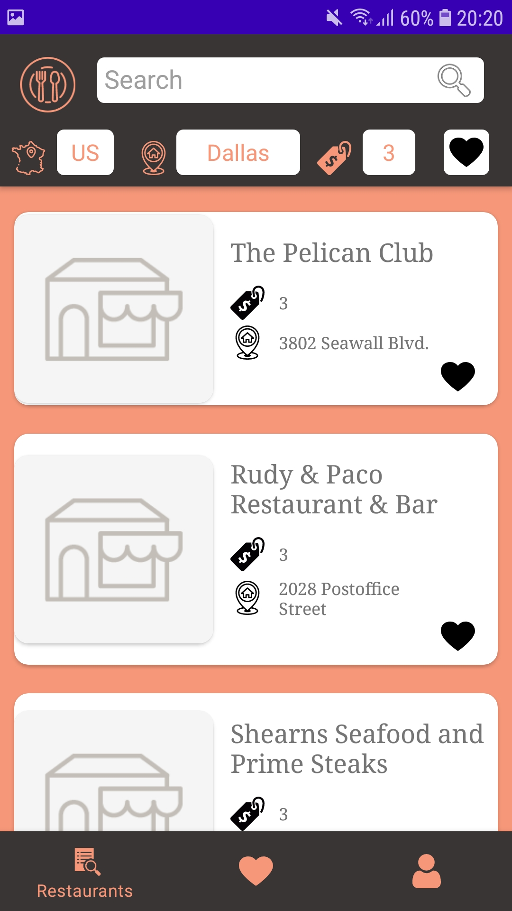
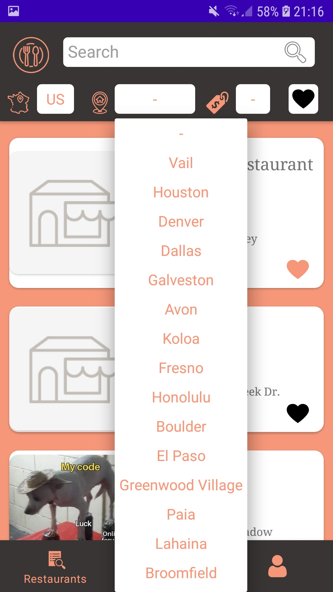
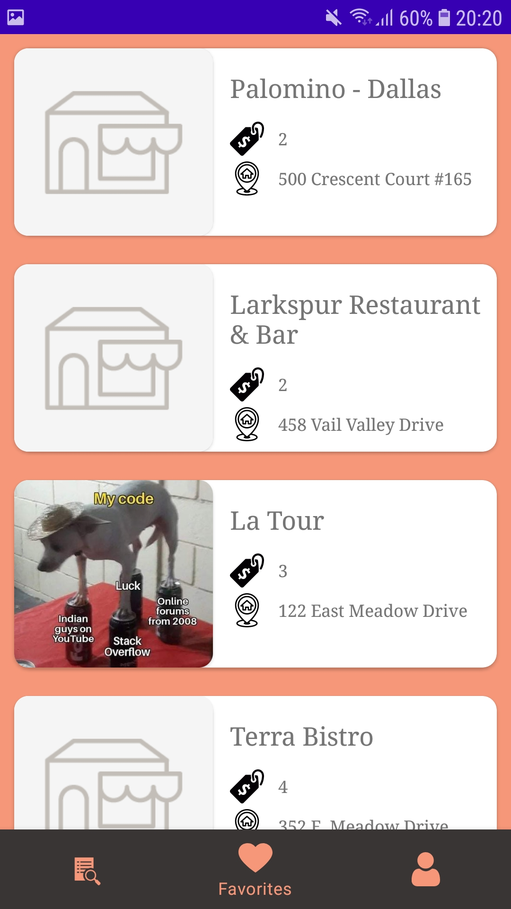
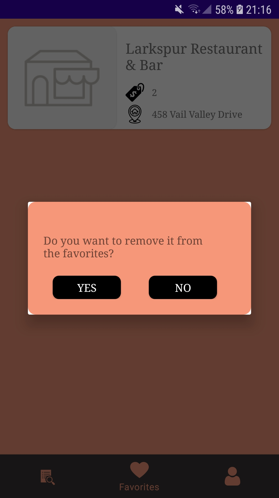
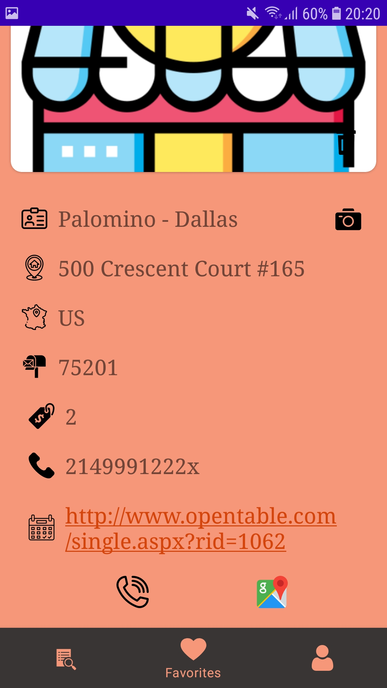
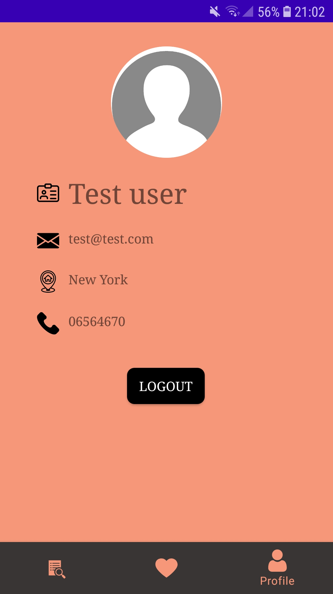

# OnPlate

University project: Android application for retrieving and displaying informations about restaurants, using a free API.

The application contains 2 activities and 8 fragments.

## Activities:

### 1. Main Activity

Contains a fragment container and a bottom navigation bar.

### 2. Maps activity

Displays Google Maps with the current restaurant's location and name. 

## Fragments:

### 1. Register fragment

Here the user can register, each user must have a unique username and email address. All inputs are validated, passwords are hashed (sha-256).

### 2. Login fragment

Here the user can login or go to registration.

### 3. Splash fragment

Where data is initialised, based on the profile section and
when the user gets from here to List Fragment, the data is already loaded.

### 4. List fragment

Here we have the main list with the restaurants. You can do text search or
filtering by Favorited data, Country list, City list, Price options. Each item has: Title, Address, Image (placeholder or image uploaded by user),
Price, Favourite icon (with this you can favourite it in/out).

|

### 5. Favorites fragment

Here we can see the list of favorite restaurants of a user. The items can be removed by long click.

### 6. Remove favorite fragment

A dialog fragment where the user can confirm the removing of a favorite, or cancel it.

### 7. Detail fragment

Here you can view all the details of what the API returned and edit it according to
the possibilities. These possibilities are: Favourites, Add/Delete Images. Other things: open
Google Maps with the coordinates of the restaurant, call the place.
Regarding displaying the images (at all the options in the app), if you have added your own
ones, then they are prioritised and those are displayed instead of the ones from the API. In the
case when you have not added images by your own, image from the API is displayed or if not exists then a
placeholder.

### 8. Profile fragment

Here you can see and manage your own profile and can log out.

